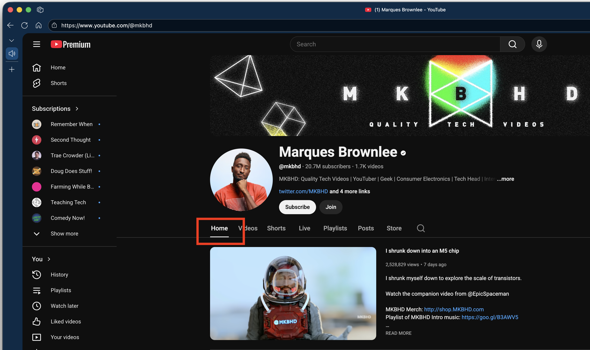
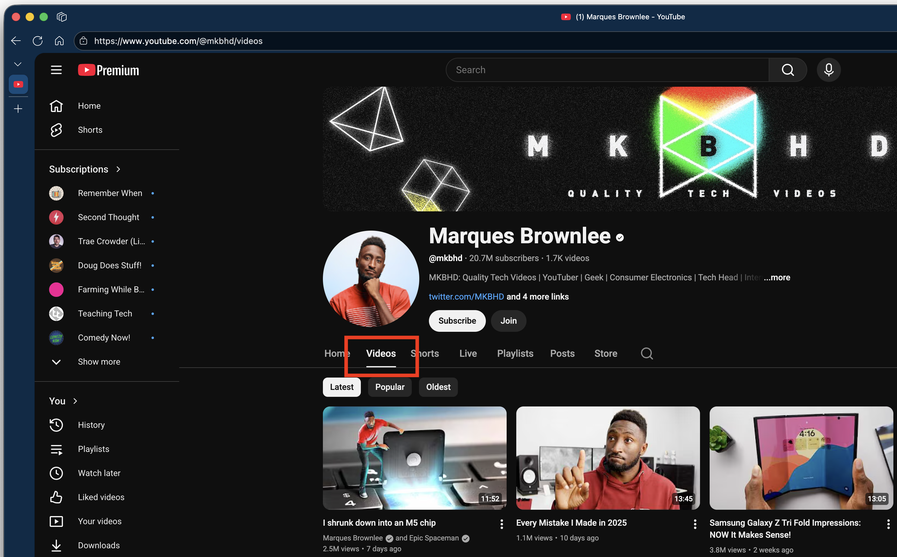

# YouTube Auto Videos Tab Extension

[](https://github.com/grimlor/youtube-videos-tab-extension/actions/workflows/ci.yml)
[](https://codecov.io/gh/grimlor/youtube-videos-tab-extension)
[](LICENSE)

A Chromium browser extension that automatically navigates to the Videos tab when visiting YouTube channel pages. Built with **TypeScript** for type safety and maintainability.

## Demo

**Before:** YouTube lands on the Home tab  


**After:** Extension automatically navigates to Videos tab  


## Features

- 🎯 Automatically switches to Videos tab on YouTube channel pages
- 🔄 Works with all channel URL formats (@username, /c/, /channel/, /user/)
- ⚡ Hybrid approach: DOM click with URL navigation fallback
- 🎨 Handles YouTube's single-page application navigation
- 🧪 Comprehensive BDD test suite
- 📘 Built with TypeScript for type safety

## Documentation

- [Design Document](DESIGN.md) - Technical design and architecture
- [BDD Testing Skill](.github/skills/bdd-testing/SKILL.md) - Testing guidelines (synced from [universal-dev-skills](https://github.com/grimlor/universal-dev-skills))
- [Changelog](CHANGELOG.md) - Version history and release notes

## Quick Start

### For Development

1. Clone this repository
2. Install dependencies:
   ```bash
   npm install
   ```
3. Build the TypeScript code:
   ```bash
   npm run build
   ```
4. Run tests:
   ```bash
   npm test
   ```
5. Load the extension in your browser:
   - Open `chrome://extensions/` (or `edge://extensions/`)
   - Enable "Developer mode"
   - Click "Load unpacked"
   - Select the **root directory of this project** (where `manifest.json` is located)
   - The extension will load the compiled `dist/content.js` file
```bash
run build         # Compile TypeScript to JavaScript
npm run build:watch   # Watch mode for development
npm test              # Run test suite
npm run test:watch    # Watch mode for testing
npm run test:coverage # Generate coverage report
npm run typecheck     # Type check without building
npm run lint          # Lint the code
npm run lint:fix      # Auto-fix linting issues
```

## Project Structure

```
├── src/
│   └── content.ts              # Main extension logic (TypeScript)
├── dist/
│   └── content.js              # Compiled JavaScript (generated)
├── tests/
│   └── content.test.ts         # BDD tests (TypeScript)
├── manifest.json               # Extension manifest (Manifest V3)
├── tsconfig.json               # TypeScript configuration
├── tsconfig.test.json          # TypeScript test configuration
├── icons/                      # Extension icons
├── DESIGN.md                   # Design documentation
└── .github/skills/             # BDD testing & dev skills (synced)
```

## Tech Stack

- **TypeScript 5.7** - Type-safe development
- **Jest + ts-jest** - Testing framework with TypeScript support
- **ESLint + TypeScript ESLint** - Code quality and style
- **Chrome Extension Manifest V3** - Modern extension API

## How It Works

1. Detects when you visit a YouTube channel's main page
2. Attempts to click the "Videos" tab element in the DOM
3. Falls back to direct URL navigation if the tab isn't found
4. Uses MutationObserver to handle YouTube's SPA navigation

## Browser Compatibility

- Google Chrome 88+
- Microsoft Edge 88+
- Brave
- Opera 74+
- Vivaldi
- Other Chromium-based browsers with Manifest V3 support

## Contributing

This is a personal project. Issues and suggestions welcome!

## License

MIT
